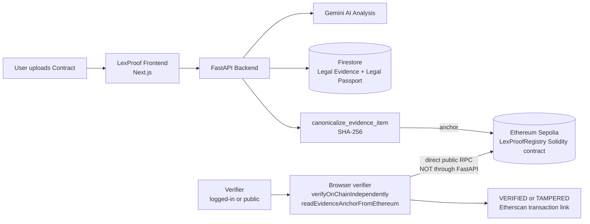

# LexProof

## Problem

AI-generated legal analysis can be modified or disputed after the fact. Today, there is no simple independent way to prove that an AI finding has not been altered since it was created.

## Solution

LexProof turns AI findings into tamper-evident legal evidence and anchors a canonical SHA-256 hash to Ethereum Sepolia. Anyone can recompute the evidence hash and compare it with the on-chain anchor without trusting LexProof's backend as the final authority.

## Architecture



## Killer Demonstration

The clearest proof is a tamper / verify / restore cycle:

```text
VERIFIED -> Firestore tampered -> TAMPERED -> Restore -> VERIFIED
```

1. Verify an anchored evidence item. The stored evidence matches its Ethereum anchor.
2. Change the stored evidence directly in Firestore to simulate tampering.
3. Verify again. The recomputed hash no longer matches, and the result is `TAMPERED`.
4. Restore the original evidence and verify once more. The result returns to `VERIFIED`.

The hash covers the canonical evidence fields defined by the application: `evidence_id`, `passport_id`, `evidence_type`, `title`, `description`, `content`, `content_type`, `risk_impact`, `compliance_impact`, `evidence_status`, `contract_reference`, `policy_reference`, `analysis_reference`, `source`, `source_id`, and `metadata`. Operational timestamps and the stored hash itself are excluded so the value can be recomputed.

## Technical Stack

- Next.js and TypeScript
- FastAPI
- Firestore
- Ethereum Sepolia
- Solidity
- ethers.js
- Gemini

## Try It

Start at the dashboard, open a contract with a Legal Passport, expand an evidence item, and select **Verify Publicly**. The public verifier accepts an evidence ID directly and shows the backend result plus an independent browser-to-Ethereum comparison.

The current verification baseline is 206/206 backend tests and 14/14 frontend tests.

## Links

- GitHub: [link]
- Live demo: [link]
- Etherscan transaction: [link]
- Hackathon submission: [link]
