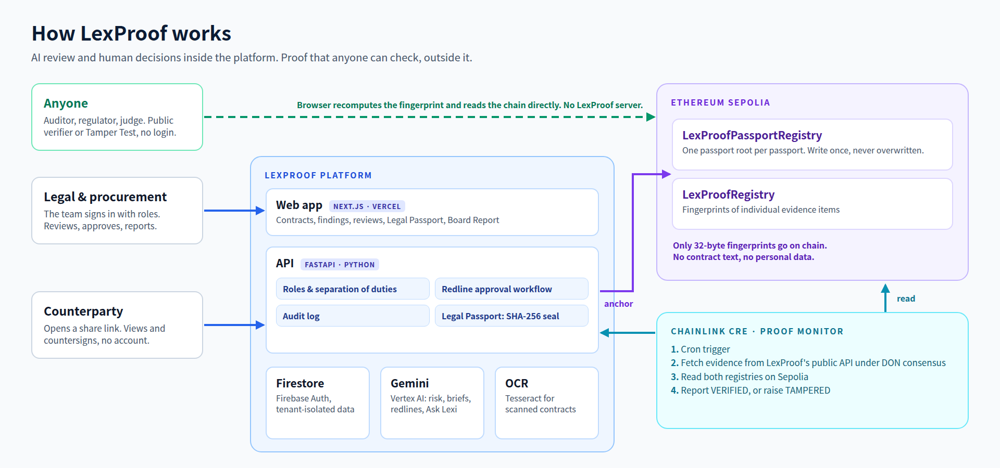
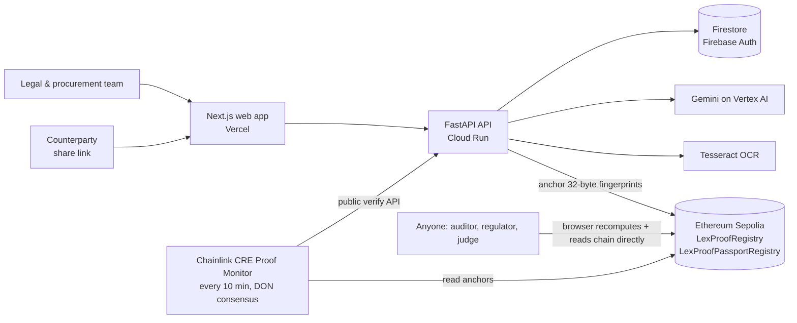

# LexProof — verifiable legal intelligence

**AI finds the risk. LexProof proves what happened.**

LexProof reviews contracts with AI, routes every proposed change through enforced human approval, and seals the result into a **Legal Passport**: a tamper-evident record whose SHA-256 fingerprint is anchored on Ethereum. Anyone can check that record in their own browser, without a login and without trusting LexProof's servers.

- **Live demo:** https://lexproof-pied.vercel.app
- **Try the Tamper Test (no login):** https://lexproof-pied.vercel.app/public-verify/tamper
- **Demo video:** see the BUIDL page (DoraHacks, BLI Legal Tech Hackathon 2)
- **Judge login:** read-only account, credentials in the BUIDL submission text

> Running on the **Ethereum Sepolia testnet** for the hackathon. Production path: mainnet or a durable L2 through a gas-sponsoring relayer, so legal teams never handle crypto. LexProof provides AI-assisted analysis for information only — not legal advice.

## The problem

AI contract review is fast, but it leaves no proof. When a finding, a redline or an approval is questioned months later — by an auditor, a regulator, a counterparty or a court — there is no independent way to show the record wasn't changed after the fact. Audit logs live inside the vendor's own system.

## What LexProof does

| Guarantee | What it means today |
|---|---|
| **Proof of process** | Every review becomes one record: AI analysis → findings → human decision → published version → evidence fingerprint → Ethereum anchor. |
| **Verify without trusting LexProof's servers** | The verifier recomputes the fingerprint in your browser and reads the anchor straight from the public chain. No login, no LexProof backend. You can also check by hand on Etherscan. |
| **Enforced, audited human approval** | Nothing in a contract changes until a *different* person approves the redline. Separation of duties applies to admins too; the only override is a break-glass that needs a written reason and is recorded in the audit trail. |
| **Privacy-preserving anchoring** | Only 32-byte fingerprints go on chain — never contract text or personal data. |

Built on top of that:

- **Legal Passport** per contract — risk and compliance scores, findings, review decisions, evidence and the anchor in one page, exportable as an evidence pack and verifiable by QR code.
- **Continuous proof monitoring** — a Chainlink CRE workflow re-checks LexProof's stored evidence against the on-chain anchors every 10 minutes and raises an alert on any mismatch ([cre/README.md](cre/README.md); demonstrated in CRE simulation).
- **Ask Lexi** — answers portfolio questions only from verified findings, cites the evidence for every claim, and says so when nothing supports an answer.
- **Counterparty portal** — counterparties review via a share link without an account.
- **Board Report** — portfolio KPIs, risk heatmap, top risks, and how much of the risk picture is provable on chain; print-ready.
- **Scanned contracts** — OCR (Tesseract) for image and scanned-PDF contracts; PII is flagged.

## Verify it yourself (2 minutes, no account)

1. Open the **[Tamper Test](https://lexproof-pied.vercel.app/public-verify/tamper)** and load the demo passport. Your browser recomputes the passport root and reads it from Sepolia: **VERIFIED**.
2. Change any single character in one component. The recomputed root no longer matches the chain: **TAMPERED**. Restore it and it verifies again.
3. Check the anchor yourself on Etherscan: [transaction 0xf94c…996f](https://sepolia.etherscan.io/tx/0xf94c893a0cfdaa24a7fc1d69227efd0e58077531cd76242ef71ad60f24db996f) (block 11810118) on the [LexProofPassportRegistry](https://sepolia.etherscan.io/address/0x21Ddd03549c2d4fb75336b616f18c34D4a9BFDE6).

How the passport root is computed:

```text
passport_root = SHA-256( canonical JSON of {
    document_hash, policy_hash, analysis_hash, evidence_hash,
    passport_hash_algorithm: "sha256" } )          # keys sorted

on-chain key  = keccak256( UTF-8(passport_id) )
LexProofPassportRegistry.passportRoots(key) == passport_root   → VERIFIED
```

Individual evidence items are anchored the same way in `LexProofRegistry` and can be checked at `/public-verify?evidence_id=<id>`.

## Architecture




```mermaid
flowchart LR
  Team[Legal & procurement team] --> Web[Next.js web app<br/>Vercel]
  CP[Counterparty<br/>share link] --> Web
  Web --> API[FastAPI API<br/>Cloud Run]
  API --> FS[(Firestore<br/>Firebase Auth)]
  API --> Gem[Gemini on Vertex AI]
  API --> OCR[Tesseract OCR]
  API -->|anchor 32-byte fingerprints| ETH[(Ethereum Sepolia<br/>LexProofRegistry<br/>LexProofPassportRegistry)]
  Anyone[Anyone: auditor, regulator, judge] -->|browser recomputes + reads chain directly| ETH
  CRE[Chainlink CRE Proof Monitor<br/>every 10 min, DON consensus] -->|public verify API| API
  CRE -->|read anchors| ETH
```

| Layer | Technology |
|---|---|
| Frontend | Next.js 14, TypeScript, Tailwind, ethers.js (browser-side chain reads) — Vercel |
| Backend | FastAPI (Python 3.12) — Google Cloud Run, keyless auth via the service's own identity, secrets in Secret Manager |
| Data & auth | Firestore, Firebase Authentication, Cloud Storage |
| AI | Gemini on Vertex AI (risk analysis, executive briefs, redline suggestions, Ask Lexi) |
| Chain | Solidity registries on Ethereum Sepolia |
| Monitoring | Chainlink CRE workflow (TypeScript) |

### Smart contracts (Ethereum Sepolia)

| Contract | Address | Purpose |
|---|---|---|
| LexProofPassportRegistry | [`0x21Ddd03549c2d4fb75336b616f18c34D4a9BFDE6`](https://sepolia.etherscan.io/address/0x21Ddd03549c2d4fb75336b616f18c34D4a9BFDE6) | One root per Legal Passport; write-once, never overwritten |
| LexProofRegistry | [`0x2C508F1CAFa4B3dD75A33b6FAcde12742f76d191`](https://sepolia.etherscan.io/address/0x2C508F1CAFa4B3dD75A33b6FAcde12742f76d191) | Fingerprints of individual evidence items |

Sources in [`contracts/`](contracts/).

### Data model (Firestore)

| Collection | Holds | Key fields |
|---|---|---|
| `organizations` (+ `members` subcollection) | Tenants and role membership | `org_id`, `name`; member `roles` (admin, contract_owner, reviewer, approver, auditor), `status` |
| `users` | Signed-in users | `user_id`, `email`, `org_memberships` |
| `contracts` | One per contract | `id`, `org_id`, `owner_id`, `name`, `status`, `current_version_id` |
| `contract_versions` | Each uploaded or published version | `contract_id`, `version_number`, `content_hash`, `document_text`, `ocr_status`, `pii_types` |
| `risk_findings` | AI findings | `contract_id`, `version_id`, `severity`, `category`, `explanation`, `recommendation` |
| `redline_proposals` | Proposed clause changes and their decisions | `contract_id`, `org_id`, `status` (PROPOSED → APPROVED/REJECTED → PUBLISHED), `created_by`, workflow history |
| `workflow_definitions` / `workflow_instances` | Approval workflow and its audited transitions (incl. break-glass) | `org_id`, states, `requires_not_actor`, history |
| `legal_passports` | The Legal Passport | `contract_id`, `org_id`, risk/compliance scores, `metadata.passport_hash`, component hashes, anchor status |
| `evidence_records` | Evidence items (immutable once anchored) | `evidence_id`, `passport_id`, canonical fields, `hash` |
| `evidence_anchors` | On-chain anchor receipts | `evidence_id`, `tx_hash`, `block_number`, `anchored_hash` |
| `audit_log` | Who did what, when | `org_id`, `actor`, `action`, `target` |
| `notifications`, `saved_views`, `portfolio_snapshots` | UX state and daily portfolio trend snapshots | |

## Run it locally

```bash
# backend
cd backend
python -m venv .venv && .venv/Scripts/activate      # Windows; use bin/activate elsewhere
pip install -r requirements-dev.txt
cp .env.example .env                                 # fill in your Firebase/GCP/Sepolia values
uvicorn app.lexproof.main:app --port 8000

# frontend
cd frontend
npm install
cp .env.example .env.local                           # NEXT_PUBLIC_API_URL=http://localhost:8000 + Firebase web config
npm run dev
```

Tests: `pytest` in `backend/` (1,000+ tests), `npx vitest run` in `frontend/`, Playwright end-to-end specs in `frontend/e2e/`.

Deployment: [docs/PUBLIC_DEMO_DEPLOYMENT.md](docs/PUBLIC_DEMO_DEPLOYMENT.md) (Vercel + one-script Cloud Run deploy).

## Honest limitations

- **Testnet.** Anchors are on Sepolia. A production deployment would anchor on mainnet or a durable L2.
- **Approvals are enforced by the server, not signed by the approver.** Separation of duties is enforced and audited, but approvals are not yet cryptographic signatures. Roadmap: passkey-signed approvals included in the anchored bundle.
- **A fingerprint proves the record hasn't changed — not that the legal analysis is correct.** LexProof is not legal advice and does not certify compliance.
- **The Chainlink monitor reads evidence from LexProof's public API.** It detects any drift between LexProof's records and anchors LexProof cannot rewrite; fetching evidence from independent storage is on the roadmap. It has been run in CRE simulation, not yet on a live DON.
- **Counterparty sign-off is not a legally binding e-signature yet.** An e-signature provider integration exists as a stub.

## Roadmap

Passkey-signed approvals · mainnet / L2 with a gas-sponsoring relayer · live CRE deployment with alerting · independent evidence storage · standalone CLI verifier · risk-tiered approval routing · SAP Ariba, Coupa and Workday integration for procurement teams.

## License

Copyright 2026 Kannan Ganesan. Licensed under the [Apache License, Version 2.0](LICENSE). See [NOTICE](NOTICE).
