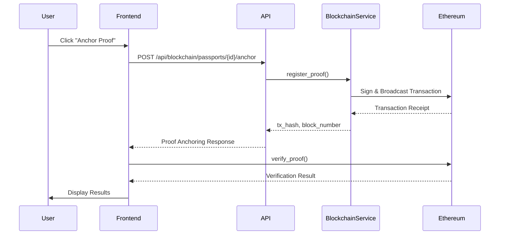
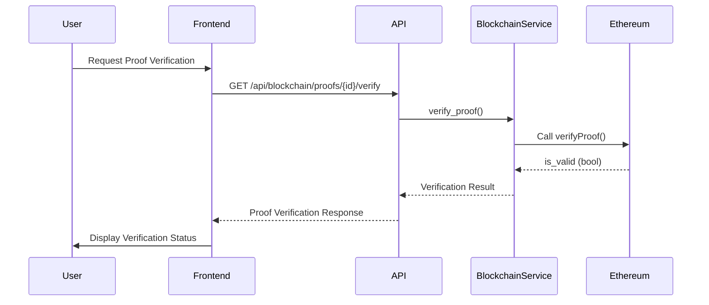

# LexProof Blockchain Proof Registry Architecture

## Overview

LexProof uses Ethereum Sepolia testnet to anchor immutable legal evidence fingerprints for contract analysis. This architecture ensures cryptographic verification of legal intelligence without storing sensitive contract content, PII, or AI findings directly on-chain.

## Security Principles

### 🔒 CRITICAL SECURITY RULES

1. **Never Store Sensitive Data On-Chain**
   - Only hashes and non-sensitive metadata are stored
   - Never store contract content, PII, contract text, or AI findings
   - All sensitive data remains off-chain in secure storage

2. **Private Key Management**
   - Never commit blockchain private keys to source control
   - Load private keys from environment variables
   - For production, use Google Secret Manager
   - Keys should be rotated regularly

3. **Access Control**
   - Proof registration is restricted to authorized users
   - All transactions are signed with user's private key
   - Audit trail tracks all registrations and verifications

## Architecture Components

### 1. Smart Contract: LexProofRegistry.sol

**Location**: [contracts/LexProofRegistry.sol](../contracts/LexProofRegistry.sol)

**Purpose**: Immutable on-chain registry for legal evidence fingerprints

**Key Features**:
- SHA-256 hash verification for proof integrity
- Access control for proof registration
- Prevention of accidental overwrite
- Event logging for audit trail
- Support for PENDING, CONFIRMED, FAILED statuses

**Contract Functions**:

```solidity
// Register a new proof on-chain
function registerProof(
    bytes32 contractHash,
    bytes32 policyHash,
    bytes32 analysisHash,
    bytes32 evidenceHash,
    uint256 riskScore,
    uint256 complianceScore,
    string memory policyVersion,
    uint256 evidenceCount
) external nonReentrant returns (bytes32 proofId)

// Verify a proof by comparing hashes
function verifyProof(
    bytes32 proofId,
    bytes32 contractHash,
    bytes32 policyHash,
    bytes32 analysisHash,
    bytes32 evidenceHash
) external view returns (bool isValid)

// Get proof details
function getProof(bytes32 proofId) 
    external view returns (...)

// Get transaction details
function getTransaction(bytes32 proofId) 
    external view returns (...)
```

**Events**:
- `ProofRegistered`: Fired when a proof is registered
- `ProofUpdated`: Fired when proof status changes
- `ProofVerified`: Fired when proof is verified

### 2. Backend: Blockchain Service

**Location**: [backend/app/lexproof/services/blockchain.py](../backend/app/lexproof/services/blockchain.py)

**Purpose**: Abstraction layer for Ethereum Sepolia interactions

**Key Features**:
- Web3.py integration
- Transaction signing and broadcasting
- Gas estimation and optimization
- EIP-1559 transaction support
- Transaction status tracking
- Error handling and retries

**Service Methods**:

```python
# Register proof on-chain
register_proof(
    contract_hash: bytes,
    policy_hash: bytes,
    analysis_hash: bytes,
    evidence_hash: bytes,
    risk_score: int,
    compliance_score: int,
    policy_version: str,
    evidence_count: int,
    max_fee_per_gas: Optional[int] = None,
    max_priority_fee_per_gas: Optional[int] = None
) -> Tuple[bytes, int]

# Verify proof on-chain
verify_proof(...) -> bool

# Get proof details
get_proof(proof_id: bytes) -> Dict[str, Any]

# Get transaction details
get_transaction(proof_id: bytes) -> Dict[str, Any]

# Check transaction confirmation
is_transaction_confirmed(tx_hash: bytes, min_confirmations: int = 12) -> bool
```

### 3. API Endpoints

**Location**: [backend/app/lexproof/api/blockchain.py](../backend/app/lexproof/api/blockchain.py)

**Endpoints**:

#### POST /api/passports/{passport_id}/anchor
Anchors a legal passport proof to Ethereum Sepolia blockchain

**Request**:
```json
{
  "contract_id": "string",
  "contract_hash": "0x...",
  "policy_hash": "0x...",
  "analysis_hash": "0x...",
  "evidence_hash": "0x...",
  "risk_score": 75,
  "compliance_score": 85,
  "policy_version": "1.0.0",
  "evidence_count": 3
}
```

**Response**:
```json
{
  "proof_id": "string",
  "transaction_hash": "0x...",
  "block_number": 5000001,
  "status": "pending",
  "timestamp": "2026-08-23T12:00:00Z",
  "network": "ethereum-sepolia",
  "contract_address": "0x..."
}
```

#### GET /api/passports/{passport_id}/proof
Gets proof details from blockchain

#### GET /api/proofs/{proof_id}/verify
Verifies a proof on blockchain by comparing hashes

#### GET /api/proofs/{proof_id}/transaction
Gets transaction details for a proof

#### GET /api/blockchain/health
Checks blockchain service health

### 4. Frontend: Anchor Proof Button

**Location**: [frontend/app/(authenticated)/legal-passport/components/AnchorProofButton.tsx](../frontend/app/(authenticated)/legal-passport/components/AnchorProofButton.tsx)

**Features**:
- One-click proof anchoring to blockchain
- Real-time verification status
- Transaction details display
- Network and contract information
- Error handling with user feedback

**UI Components**:
- Anchor button with loading state
- Status badges (PENDING, CONFIRMED, FAILED, VERIFIED)
- Transaction hash display
- Block number and timestamp
- Verification status indicator

## Data Flow

### Proof Anchoring Flow



### Proof Verification Flow



## Transaction Status

The system tracks transaction status using the following states:

| Status | Description |
|--------|-------------|
| `pending` | Transaction submitted to network, awaiting confirmation |
| `confirmed` | Transaction confirmed on blockchain |
| `failed` | Transaction failed (will retry automatically) |

## Security Implementation

### 1. Private Key Protection

```python
# BAD - Never do this
private_key = "0x1234567890abcdef..."

# GOOD - Load from environment
private_key = os.getenv('BLOCKCHAIN_PRIVATE_KEY')

# BEST - Load from Secret Manager for production
private_key = secret_manager.get_secret('blockchain-private-key')
```

### 2. Hash Verification

All on-chain data is verified using SHA-256 hashes:

```python
# Off-chain: Compute hash
document_hash = sha256(document_content.encode()).hexdigest()

# On-chain: Store only hash
blockchain.register_proof(
    contract_hash=bytes.fromhex(document_hash),
    # ... other hashes
)
```

### 3. Access Control

Proof registration requires valid authentication:

```python
@router.post("/passports/{id}/anchor")
async def anchor_proof(
    passport_id: str,
    request: ProofAnchoringRequest,
    background_tasks: BackgroundTasks
):
    # Verify user is authenticated
    # Verify user has permission to register proofs
    # ... proceed with anchoring
```

## Gas Optimization

### Gas Estimation

The service automatically estimates gas costs before transaction:

```python
gas = blockchain.estimate_gas(contract_function)
transaction['gas'] = gas
```

### EIP-1559 Support

The service supports EIP-1559 transactions for better gas fee optimization:

```python
tx_hash, block_number = blockchain.register_proof(
    # ... parameters
    max_fee_per_gas=50000000000,  # 50 Gwei
    max_priority_fee_per_gas=2000000000  # 2 Gwei
)
```

## Retry Strategy

The system implements retry-safe, idempotent transaction handling:

1. **Transaction Submission**: Retry on transient failures
2. **Confirmation Check**: Verify transaction status
3. **Verification**: Compare on-chain hashes with off-chain data
4. **Idempotency**: Prevent duplicate registrations for same proof

## Testing Strategy

### Unit Tests

- Mock Web3 and Ethereum interactions
- Test all service methods
- Verify error handling
- Test validation logic

### Integration Tests

- Test with test network (Sepolia)
- Verify actual transaction flow
- Test end-to-end API calls
- Validate response formats

### Test Coverage

See [tests/lexproof/blockchain/test_blockchain_service.py](../backend/tests/lexproof/blockchain/test_blockchain_service.py)

## Deployment Checklist

- [ ] Deploy smart contract to Ethereum Sepolia
- [ ] Configure environment variables
  - [ ] ETHEREUM_RPC_URL
  - [ ] CONTRACT_ADDRESS
  - [ ] BLOCKCHAIN_PRIVATE_KEY
- [ ] Set up Google Secret Manager for private key (production)
- [ ] Configure network monitoring
- [ ] Set up gas price alerts
- [ ] Create backup procedures for private keys
- [ ] Test with test transactions
- [ ] Verify proof anchoring works end-to-end
- [ ] Test verification functionality
- [ ] Monitor transaction confirmations
- [ ] Set up error alerting

## Cost Considerations

### Gas Costs (Sepolia Testnet)

- Register proof: ~50,000 - 100,000 gas
- Verify proof: ~10,000 - 20,000 gas
- Get proof: ~5,000 - 10,000 gas

**Note**: Sepolia testnet is free, but real costs will apply to mainnet.

### Optimization Strategies

1. Batch multiple proofs (future enhancement)
2. Use higher gas price for faster confirmations
3. Implement gas price monitoring
4. Cache on-chain data to reduce RPC calls

## Monitoring and Alerting

### Key Metrics

- Transaction success rate
- Average confirmation time
- Gas price trends
- Transaction failures
- Proof verification accuracy

### Alerts

- Transaction failures
- Low gas price (for faster confirmations)
- Network congestion
- Private key rotation reminders

## Future Enhancements

1. **Mainnet Deployment**: Deploy to Ethereum mainnet
2. **Multi-Chain Support**: Add support for other chains
3. **Batch Anchoring**: Anchor multiple proofs in one transaction
4. **Proof Expiration**: Implement proof lifecycle management
5. **Proof Revocation**: Support for proof revocation (if needed)
6. **Advanced Analytics**: On-chain analytics and insights

## References

- [Solidity Documentation](https://docs.soliditylang.org/)
- [OpenZeppelin Contracts](https://docs.openzeppelin.com/contracts/)
- [Web3.py Documentation](https://web3py.readthedocs.io/)
- [Ethereum Sepolia Testnet](https://sepolia.dev/)
- [EIP-1559](https://eips.ethereum.org/EIPS/eip-1559)
