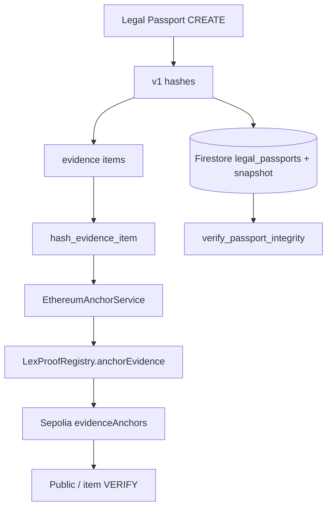
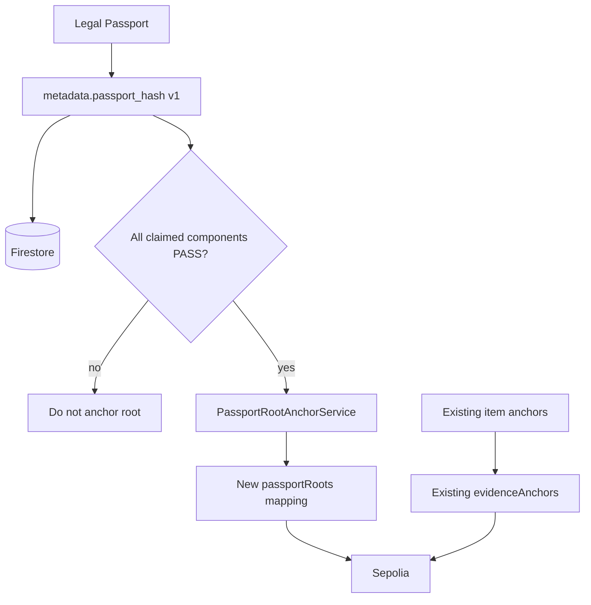
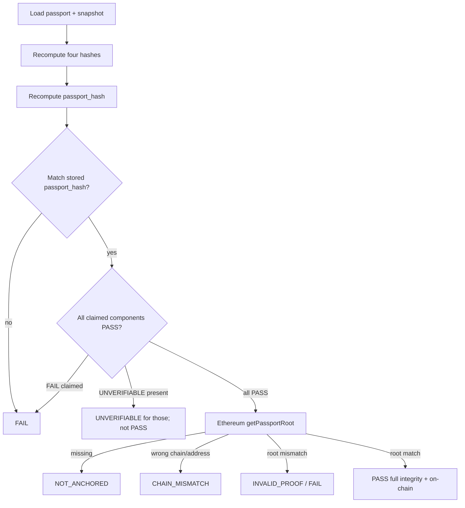

# LexProof Passport-Root Anchor Architecture

**Date:** 2026-09-18  
**Status:** IMPLEMENTED AND LOCALLY VERIFIED — additive Solidity, backend, tests, and deployment safety verification are complete. Sepolia deployment and live transactions have not been executed. Live Chromium E2E remains pending.

This document proposes an **additive** Sepolia commitment of the Legal Passport root (`metadata.passport_hash`). It must be reviewed before any implementation.

---

## 1. Executive Summary

LexProof already anchors **per-evidence-item** SHA-256 digests on Ethereum Sepolia via `LexProofRegistry.anchorEvidence`. That path is production for the current trust claim and must stay unchanged.

A **Legal Passport root** already exists off-chain: `compute_passport_hash()` → `metadata.passport_hash` (SHA-256 of the four component hashes plus `"passport_hash_algorithm": "sha256"`). It is **not** written on-chain today.

The contract also contains `registerProof` / `verifyProof`. That primitive is **not** a safe reuse target for passport-root anchoring: it stores risk/compliance scores and policy version on-chain, identifies proofs by `keccak256` of the four hashes (not SHA-256 `passport_hash`, not `passport_id`), accepts client-supplied hashes on an existing backend route, and is not wired to the integrity snapshot verifier.

**Recommendation:** keep the deployed item registry as-is. Add a **dedicated passport-root mapping and methods** (new deploy of an additive contract or an additive v2 address). On-chain payload: `bytes32 passportKey` + `bytes32 passportRoot` (+ timestamp, registrar). Off-chain: Firestore `passport_anchors` mirroring `evidence_anchors`. Anchor only when all four snapshot components are `PASS`. Never treat `UNVERIFIABLE` as `PASS`.

```text
CURRENT STATE
--------------
Item-level anchoring: READY
Passport integrity: READY (claimed inputs fail-closed)
Passport-root anchoring: IMPLEMENTED and locally EVM-verified
Contract change: IMPLEMENTED in `LexProofPassportRegistry.sol`
Deployment script: IMPLEMENTED and safety-validated
Sepolia deployment: NOT PERFORMED
Live transactions: NONE
Historical anchors changed: NO
Canonicalization v1 changed: NO
```

---

## 2. Current Blockchain Architecture

### 2.1 Code map (inspected)

| Area | Location |
|---|---|
| Solidity | `contracts/LexProofRegistry.sol` |
| Compile | `contracts/compile.sh`, `contracts/package.json` (`solc@0.8.20`, OZ `4.9.6`) |
| Deploy | `contracts/deploy_sepolia.py` (explicit, Sepolia-only, `ETHEREUM_*` env) |
| ABI | `contracts/build/*LexProofRegistry.abi` (loaded by `BlockchainService._load_contract_abi`) |
| Config | `backend/app/lexproof/config/settings.py`: `ETHEREUM_RPC_URL`, `ETHEREUM_CHAIN_ID` (11155111), `ETHEREUM_CONTRACT_ADDRESS`, `ETHEREUM_PRIVATE_KEY` |
| Low-level web3 | `backend/app/lexproof/services/blockchain.py` |
| Item anchoring | `backend/app/lexproof/services/ethereum_anchor_service.py` |
| Item API | `backend/app/lexproof/api/evidence_anchor.py` |
| Unused passport `registerProof` API | `backend/app/lexproof/api/blockchain.py` `POST /passports/{passport_id}/anchor` |
| Persistence | `evidence_anchors` (`EvidenceAnchorRepository`, create-once); optional `blockchain_proofs` if `BLOCKCHAIN_PERSISTENCE=firestore` |
| Public verify | `GET /api/verify/{evidence_id}`; `frontend/app/public-verify/page.tsx`; `frontend/lib/ethereum.ts` |
| UI | `AnchorProofButton.tsx` (item only; no passport-root button) |
| Tests | `backend/tests/lexproof/test_ethereum_anchor_service.py`, `tests/lexproof/blockchain/test_blockchain_service.py`, `tests/test_public_verification.py`, `tests/test_blockchain_audit_events.py` |
| Merkle | `scripts/create_merkle_batch_demo_anchor.py` — **demo/mock only** (`is_mock: true`) |

Contract **address is not in git**. It lives in environment-managed `.env` / `NEXT_PUBLIC_LEXPROOF_CONTRACT_ADDRESS`. This review does not print or invent an address.

### 2.2 Current item flow (actual)

```text
PassportService._create_evidence_items
    → hash_evidence_item (canonicalization v1)
    → evidence_records.set
    → VersionAnalysisService (optional) EthereumAnchorService.anchor_evidence
        → Firestore evidence_anchors.get (idempotent reuse)
        → else getEvidenceAnchor on chain (recover)
        → else BlockchainService.anchor_evidence(evidence_id, bytes.fromhex(hash))
            → onlyRegistrar anchorEvidence(string recordId, bytes32 hash)
            → wait receipt, require status==1
        → evidence_anchors.set (create-once)
    → VERIFY: hash_evidence_item(firestore dict) vs verifyEvidence / bytes equality
```

Network: constructor and `_ensure_sepolia` require chain ID **11155111**.

Signer: server `ETHEREUM_PRIVATE_KEY`. Not an end-user wallet.

### 2.3 Existing unused passport-proof flow (actual, not recommended)

```text
POST /api/passports/{passport_id}/anchor
    → client-supplied contract/policy/analysis/evidence hashes + risk/compliance + policyVersion + evidenceCount
    → BlockchainService.register_proof(...)
    → LexProofRegistry.registerProof
    → in-memory/optional Firestore blockchain_proofs
```

No frontend caller. Does **not** load `verification_snapshot` or call `verify_passport_integrity`. Handler signature has **no** `get_current_user`. Treat as unsafe to enable as-is.

### 2.4 Doc vs code disagreements

| Claim | Source | Actual code |
|---|---|---|
| Wallet is not a registrar **for `registerProof` specifically** | `docs/LIMITATIONS.md`, `docs/ARCHITECTURE.md` (2026-09-04) | `anchorEvidence` and `registerProof` share `onlyRegistrar`. If item anchoring succeeds on an instance, the same signer is authorized for `registerProof` on **that** instance. The LIMITATIONS note may be stale or about a different deployment/ABI. |
| `registerProof` snippet has no registrar gate | `docs/BLOCKCHAIN_ARCHITECTURE.md` | `onlyRegistrar` + `nonReentrant` |
| `verifyProof` emits `ProofVerified` | `docs/BLOCKCHAIN_ARCHITECTURE.md` | Comment in Solidity: verification is view; **no event** |
| Only hashes on-chain for passport proofs | comments / ETHEREUM_ANCHORING.md spirit | `registerProof` **stores riskScore, complianceScore, policyVersion, evidenceCount** |
| Passport-level proof never registered | LIMITATIONS | Backend **route exists**; UI does not call it |

None of these were changed in this design task.

---

## 3. Current Smart Contract Analysis

**File:** `contracts/LexProofRegistry.sol`  
**Solidity:** `^0.8.20`  
**Bases:** OpenZeppelin `Ownable`, `ReentrancyGuard`  
**Network (ops):** Ethereum Sepolia `11155111`  
**Constructor:** `Ownable(initialOwner)`; `authorizedRegistrars[initialOwner] = true`

### Access

- `onlyOwner`: `setRegistrar`, `updateProofStatus`
- `onlyRegistrar`: `anchorEvidence`, `registerProof`
- Anyone: view methods

Writes are **not fully immutable**: `updateProofStatus` can change `Proof.status` (owner). Evidence anchors have **no update/delete** in the contract (first write wins; zero-hash check).

### Evidence storage

```text
keccak256(bytes(recordId)) → { evidenceHash, timestamp (block.timestamp), anchoredBy }
Duplicate: revert "Evidence already anchored"
Zero hash / empty id: revert
```

`recordId` is a **string in calldata** (evidence UUID is therefore publicly reconstructable from the tx). Indexed event field is the **hash of the string**, not the plaintext, but calldata still contains the UUID.

### Passport `registerProof` storage

```text
proofId = keccak256(abi.encode(contractHash, policyHash, analysisHash, evidenceHash))
```

This is **Keccak-256 of four bytes32s**, not SHA-256 `metadata.passport_hash`. Duplicate `proofId`: **return existing id, no event, no revert**. `evidenceCount` must be `> 0`. `Proof` includes scores and `policyVersion` (public forever).

`getTransaction` is largely unused: `registerProof` does not fill `transactions[]`.

Gas: one mapping write + event for `anchorEvidence` (same order of magnitude as a future root write). `getAllProofIds()` returns the full array — does not scale; do not use for public verify.

**Formal audit:** none (`docs/LIMITATIONS.md` §10).

---

## 4. Current Passport Integrity Model

Confirmed in `hashing.py` / `integrity.py` / tests:

- CREATE writes `document_hash`, `policy_hash`, `analysis_hash`, `evidence_hash`, `metadata.passport_hash`, `metadata.verification_snapshot`.
- VERIFY recomputes claimed snapshot inputs; statuses are `PASS` / `FAIL` / `UNVERIFIABLE`.
- `passport_hash_verified` binds **stored** four hashes to `metadata.passport_hash`, not snapshot bytes by themselves.
- Live post-publish evidence is ignored when `snapshot.evidence_items` is present.
- Extracted text, not raw file bytes, is in `document_hash`.

Product: **published passport = immutable snapshot**.

---

## 5. Passport Root Commitment Definition

**Do not change v1.** Exact CREATE/VERIFY bytes:

```text
passport_data = {
  "document_hash": <64-char hex str>,
  "policy_hash": <64-char hex str>,
  "analysis_hash": <64-char hex str>,
  "evidence_hash": <64-char hex str>,
  "passport_hash_algorithm": "sha256",
}
canonical JSON = json.dumps(passport_data, sort_keys=True, ensure_ascii=False)
```

`sort_keys=True` means the hashed object key order is:

```text
analysis_hash, document_hash, evidence_hash, passport_hash_algorithm, policy_hash
```

Separators: `(", ", ": ")`. Digest: SHA-256 UTF-8, lowercase hex, 64 chars. Stored as `metadata.passport_hash`.

On-chain, store the **32-byte decode** of that hex (`bytes.fromhex(passport_hash)`), same as item hashes.

`metadata.passport_hash` is **sufficient as the cryptographic commitment of the four v1 component hashes**. Additional context (`passport_id`, `canonicalization_version`) should **not** be mixed into that digest (would break v1 and existing tests). Put identity and version **beside** the digest (storage key / event / Firestore), not inside it.

---

## 6. Candidate Anchor Designs

### Option A — Anchor `metadata.passport_hash` only

Deterministic, independently reproducible, privacy-minimal (32 bytes). No passport identity on-chain unless a separate key is used. Two different passports with identical component hashes collide if the storage key is the hash itself. Replay of the same root under another id is possible if only the hash is keyed.

### Option B — `hash(document_hash + policy_hash + analysis_hash + evidence_hash)` without the algorithm label

Not v1. `registerProof` already uses **Keccak** `abi.encode` of four bytes32s — a **different** digest than SHA-256 JSON. Independent verifiers who implement `compute_passport_hash` would not match. Reject for the product root.

### Option C — Structured commitment `{passport_id, passport_hash, canonicalization_version, hash_algorithm}` hashed again

New digest ≠ existing `metadata.passport_hash`. Requires versioned hashing. Better as **off-chain metadata + on-chain (key, root)** than as a replacement digest. Putting `passport_id` in a hashed blob that is then published still leaks if the preimage is known (it is: UUID).

### Option D — Dual field: `passportKey` + `passportRoot` (recommended)

- `passportRoot` = v1 `metadata.passport_hash` as `bytes32`
- `passportKey` = `keccak256(bytes(passport_id))` (or `keccak256(abi.encodePacked(namespace, passport_id))`)
- Version/algorithm only in event or off-chain

Matches item-anchor shape (`recordKey → hash`) without sharing the `evidenceAnchors` mapping.

---

## 7. Trade-off Matrix

| Criterion | A hash-only | B keccak four hashes (`registerProof`) | C new structured digest | D key + v1 root |
|---|---|---|---|---|
| Determinism | Yes | Yes, but **not v1 SHA-256** | Only after new spec | Yes (v1 root) |
| Independent verify | Yes if you have the four hashes | Needs keccak recipe | Needs new recipe | Yes |
| Replay / identity | Weak | Weak (hash tuple) | Depends | Strong (per passport_id) |
| Privacy | Best | **Poor** (scores, policy version) | ID in preimage | Key is hash of UUID; UUID still in calldata if passed as string |
| Back-compat item anchors | N/A | Separate mapping already | N/A | Additive mapping |
| Gas | Lowest | Higher (many fields) | Medium | Low (two bytes32) |
| Migration | Easy | Reuse existing method (wrong semantics) | Hard (new hash) | New method + new address |
| Future `canonicalization_version` | Off-chain | Not modeled | In digest (breaks v1) | Event/storage sidecar |
| Proves which passport | No | No | If id included | Yes via key |
| Tenant/PII on-chain | No | Scores ≈ assessment leak | If careless | Must not put tenant_id |

---

## 8. Recommended Architecture

**Additive two-level model:**

```text
                LexProof
                   │
        ┌──────────┴──────────┐
        │                     │
 Evidence Item           Legal Passport
        │                     │
 hash_evidence_item      metadata.passport_hash (v1)
        │                     │
 LexProofRegistry        NEW passport-root registry
 (existing Sepolia       (new methods / new address)
  evidenceAnchors)
        │                     │
    Sepolia               Sepolia
```

**On-chain:** `passportKey → { passportRoot, timestamp, anchoredBy }` first-write-wins.  
**Off-chain:** `passport_anchors/{passport_id}` with tx hash, block, chain id, contract address, `canonicalization_version: 1`, `hash_algorithm: sha256`.  
**Eligibility:** `verify_passport_integrity` all four components `PASS` and `passport_hash_status == PASS`. Legacy / evidence-only snapshots: **do not anchor**; public full-integrity result stays `UNVERIFIABLE` for missing components.  
**Do not** call `registerProof` for this.  
**Do not** put roots in `evidenceAnchors` (UUID namespace collision + no type).  
**Do not** change `hash_evidence_item` or v1 JSON.

### Diagrams

#### Current



#### Proposed (additive)



#### Verification



#### Failure / retry

```mermaid
stateDiagram-v2
  [*] --> NOT_ANCHORED
  NOT_ANCHORED --> PENDING: submit tx
  PENDING --> ANCHORED: receipt status=1 and Firestore write
  PENDING --> UNKNOWN: timeout; tx may still confirm
  UNKNOWN --> ANCHORED: recover from chain
  UNKNOWN --> FAILED: no receipt after policy
  PENDING --> FAILED: revert / RPC error
  FAILED --> PENDING: retry if chain empty
  ANCHORED --> ANCHORED: idempotent reuse
  FAILED --> FAILED: chain has different root
```



---

## 9. Contract Interface Proposal

**Design 1 — reuse `registerProof`:** technically callable, **not appropriate** (privacy, wrong digest, no passport identity, client-hash API, scores on-chain, `evidenceCount > 0`, silent duplicate).

**Design 2 — dedicated methods (recommended):**

Conceptual (do not implement in this task):

```solidity
bytes32 constant PASSPORT_ROOT_TYPE = keccak256("LEXPROOF_LEGAL_PASSPORT_ROOT_V1");

struct PassportRootAnchor {
    bytes32 passportRoot; // SHA-256 metadata.passport_hash
    uint256 timestamp;
    address anchoredBy;
}

mapping(bytes32 => PassportRootAnchor) public passportRoots;

function anchorPassportRoot(bytes32 passportKey, bytes32 passportRoot) external onlyRegistrar nonReentrant;
function verifyPassportRoot(bytes32 passportKey, bytes32 passportRoot) external view returns (bool);
function getPassportRoot(bytes32 passportKey) external view returns (bytes32 passportRoot, uint256 timestamp, address anchoredBy);
```

- `passportKey`: `keccak256(bytes(passport_id))` computed **off-chain** so storage/calldata need not include the UUID string (calldata still public if a string overload is used — **prefer bytes32 key**).
- `passportRoot != 0`; duplicate key reverts (same as evidence).
- No scores, no policy version, no tenant id, no filename.

**Design 3 — generic typed commitment:**

```solidity
function anchorCommitment(bytes32 typeId, bytes32 recordKey, bytes32 digest) external onlyRegistrar;
```

Flexible for future types; extra complexity and easier to misuse (wrong `typeId`). Prefer a **dedicated mapping** now, with `typeId` only in the event as a constant, rather than a single generic map shared with evidence.

**Access:** same `onlyRegistrar` / `onlyOwner` pattern. Do not add public write.

**Chain ID:** enforce 11155111 in backend as today; optionally `block.chainid` is implicit in the deployment.

---

## 10. Storage Proposal

### On-chain

One slot per passport key: 32-byte root + uint256 timestamp + address. No PII.

### Off-chain Firestore `passport_anchors/{passport_id}`

Mirror `evidence_anchors`:

- `passport_id`, `passport_hash`, `passport_key`, `transaction_hash`, `block_number`, `anchored_at`, `blockchain_network: ethereum-sepolia`, `contract_address`, `chain_id: 11155111`, `canonicalization_version: 1`, `hash_algorithm: sha256`, `anchoring_method: SINGLE_HASH`
- Create-once repository (like `EvidenceAnchorRepository`)
- **Do not** write this into `evidence_anchors`

Keep `ETHEREUM_CONTRACT_ADDRESS` pointed at the **existing** item registry. New env e.g. `ETHEREUM_PASSPORT_REGISTRY_ADDRESS` for the additive contract.

---

## 11. Event Proposal

```text
event PassportRootAnchored(
    bytes32 indexed passportKey,
    bytes32 indexed passportRoot,
    uint256 timestamp,
    address indexed anchoredBy
);
```

Do not index a plaintext UUID. Optional non-indexed `uint8 canonicalizationVersion` in the event only (not in the v1 digest).

---

## 12. Identity / Replay / Duplicate Model

| Model | Verdict |
|---|---|
| Storage key = `passport_hash` | Collides distinct passports with same assessment bytes; cannot tell which id was published |
| Storage key = `passport_id` string | Identity OK; UUID in calldata forever |
| Storage key = `keccak256(passport_id)` | **Recommended** |
| `hash(passport_id + passport_hash)` as only key | Changing the root looks like a new record (allows silent “replacement” by a second tx) |

**First write wins.** Same passport_id + same root: idempotent recover (like items). Same passport_id + different root: **hard fail** (do not overwrite). New contract version → new `passport_id` (already `generate_passport_id()` per CREATE) → new key.

Superseding: a later passport is a different id; both roots can exist. Product should show which passport_id is current off-chain.

Malicious second tx with same key: contract reverts. Malicious same root under another stolen/guessed UUID: attacker must know/choose `passport_id`; UUID v4 is not a secret but is not tenant_id. Do not put tenant_id on-chain.

---

## 13. Privacy Model

**On-chain (allowed):** 32-byte root, 32-byte key, timestamp, registrar address, tx metadata.

**On-chain (forbidden):** contract text, evidence text, analysis JSON, filenames, supplier names, user_id, tenant_id, emails, raw files.

**Avoid (existing `registerProof` does this):** risk_score, compliance_score, policy_version, evidence_count as public assessment profile.

**Calldata warning:** `anchorEvidence(string recordId, …)` already publishes evidence UUIDs. Passport-root should use `bytes32 passportKey` to avoid adding another plaintext UUID channel. Parties who already possess the passport still derive the key.

Public chain is forever: assume chain explorers and scrapers.

---

## 14. Versioning Model

v1 digest **must not** include `canonicalization_version` (would change `metadata.passport_hash` and break tests/records).

Place version:

| Location | v1 | Future incompatible encoding |
|---|---|---|
| Inside SHA-256 passport_hash | **No** | New `compute_passport_hash_v2` + stored version field |
| Tx / event `uint8` | Optional metadata | Yes, so public verifiers know which decoder |
| Contract storage extra field | Optional | Yes |
| Firestore only | Minimum for v1 launch | Insufficient for trustless public verify of v2 |

`hash_algorithm` for v1 is implied (SHA-256, 32 bytes). Do not put `"sha256"` string on-chain.

---

## 15. Backward Compatibility

| Passport class | Local integrity | Root anchor allowed? | Chain verifier |
|---|---|---|---|
| Legacy, no snapshot | Components `UNVERIFIABLE`; stored hashes may still bind | **No** | `UNVERIFIABLE` / `NOT_ANCHORED`, never `PASS` full |
| Repaired evidence-only snapshot | Evidence may `PASS`; doc/policy/analysis `UNVERIFIABLE` | **No** | Same |
| Current complete snapshot | All four `PASS` | **Yes** | Local PASS + chain match → full PASS |
| Future anchored complete | All four `PASS` + root tx | Yes | Full PASS |

**Never** convert `UNVERIFIABLE` → `PASS` because a root exists. On-chain existence ≠ complete snapshot.

Existing Sepolia **item** txs remain on the current contract address. New root txs must not reuse `evidenceAnchors` keys.

Existing `POST /passports/{id}/anchor` should stay unused or be replaced in a later phase; do not point the new UI at it.

---

## 16. Verification State Machine

Distinct states (do not collapse):

| State | Meaning |
|---|---|
| `PASS` | All **claimed** components hashed and matched, `passport_hash` matches stored, on-chain root matches, chain id + registry address match |
| `FAIL` | Claimed input missing/unusable or any digest mismatch (snapshot or stored hashes or chain root) |
| `UNVERIFIABLE` | Snapshot does not claim a component; full passport-root **PASS is forbidden** |
| `NOT_ANCHORED` | Local integrity may pass; no root on expected registry |
| `NETWORK_ERROR` | RPC failure; do not treat as PASS or FAIL of the hash |
| `CHAIN_MISMATCH` | Connected chain id ≠ 11155111 or contract address ≠ configured registry |
| `INVALID_PROOF` | Anchor exists but root ≠ recomputed `passport_hash`, or proof type/key mismatch |
| `PENDING` / `UNKNOWN` | Tx submitted, receipt not yet known (ops, not a crypto PASS) |

**On-chain existence** (key has a nonzero root on the expected contract) is a **weaker** claim than **full passport integrity**.

---

## 17. Failure / Retry / Idempotency

Reuse the item-anchor playbook in `EthereumAnchorService`:

1. If Firestore anchor exists and hash matches → return (no tx).
2. Else if chain has matching root → recover metadata, write Firestore.
3. Else if chain has **different** root → fail hard.
4. Else submit tx; on revert, re-read chain (race) then fail.
5. If receipt succeeds and Firestore `set` fails → retry recover path (create-once may throw if partial write).
6. If Firestore written but tx never sent → next retry sees Firestore… **must not** persist Firestore before receipt. **Write Firestore only after `status==1`.** Items already do this.
7. Timeout after send: state `UNKNOWN`; recover via `getPassportRoot` + log scan.
8. Double-click: same as (1)/(2)/(4 race).

States: `NOT_ANCHORED | PENDING | UNKNOWN | ANCHORED | FAILED` are sufficient.

---

## 18. Threat Model

| ID | Attack | Current protection | Implemented root protection | Residual |
|---|---|---|---|---|
| A | Change evidence after publish | Snapshot hash; item chain if anchored | Root covers **publish-time** package, not live appends | Live appends still item-level |
| B | Change snapshot | Component FAIL | Cannot match anchored root without also changing stored hashes+root | Firestore+chain rewrite needs registrar key for chain |
| C–F | Change stored component hashes | Local FAIL vs snapshot; passport_hash bind | Root mismatches unless attacker also re-anchors (blocked) | |
| G | Change `metadata.passport_hash` | Local FAIL | Chain still has old root | |
| H | Consistent Firestore rewrite | **No** local detection | **Detected** if root already anchored | Unanchored passports still vulnerable |
| I | Second passport-root tx | n/a | Contract duplicate revert | New passport_id is a new key (product must not confuse versions) |
| J | Replay old tx | n/a | Different nonce; replay of raw tx fails; copy of root under new key needs registrar | |
| K | Wrong network/address | Backend chain_id check | `CHAIN_MISMATCH`; pin registry address | User RPC spoof if they ignore pin |
| L | Unauthorized signer | `onlyRegistrar` | Same | Stolen registrar key is catastrophic (existing T3) |
| M | Duplicate anchor request | Item idempotency | Same pattern | |
| N | Future canonicalization mismatch | n/a | Version sidecar; refuse silent decode | Operator error if version ignored |

Owner `updateProofStatus` remains a residual on the **old** `Proof` struct; do not use that struct for roots.

---

## 19. Multi-Tenant Security

- Authorize like item anchor: caller can read the passport (`is_visible_via_contract` / owner), then **server** signs.
- Do not trust client hashes (unlike current `ProofAnchoringRequest`).
- Recompute `passport_hash` on the server from stored snapshot.
- Cross-tenant: cannot anchor another org’s passport if GET is 404.
- On-chain: no `org_id` / `user_id`. UUID `passport_id` hashed as key is not a tenant label but is a correlation handle for anyone who already has the passport.
- Registrar is global, not per-tenant — same as today (all orgs share one Sepolia writer).

---

## 20. Gas / Scale Considerations

| Volume | One tx per passport (recommended now) | Merkle batch |
|---|---|---|
| 1–100 | Fine on Sepolia | Unnecessary |
| 1,000 | Cost scales linearly; still simple | Optional later |
| 10,000–100,000 | Fees dominate; ops need batching | Real Merkle **not** production today |

Current Merkle script is **mock**. Do not schedule it as the v1 passport-root design. v1 = `SINGLE_HASH` per passport, same as items.

`getAllProofIds()`-style arrays must not be used for roots.

---

## 21. Public Verification Model

### On-chain existence (no confidential Firestore)

Public inputs:

- `passport_id` (or precomputed `passportKey`)
- `passport_hash` (64-char hex)
- `chain_id` = 11155111
- `passport_registry_address`
- proof type = legal passport root v1

Procedure: `getPassportRoot(passportKey)`; compare `bytes32`; confirm `chain_id` and address. Optional: Etherscan tx/block from event logs (best-effort, as with items).

### Full passport integrity (requires snapshot)

Needs `verification_snapshot` (sensitive). Not a public-widget default. Authenticated `/passports/{id}/verify` plus chain check.

Do not require evidence **content** to prove the root exists.

---

## 22. Test Strategy (write these first in the next phase)

### Unit

- `passportKey = keccak256(utf8(passport_id))` golden vector (independent hashlib/keccak)
- v1 `passport_hash` still matches existing independent SHA-256 JSON golden
- Eligibility: complete PASS vs UNVERIFIABLE vs FAIL
- Duplicate / conflicting root handling (pure Python state machine)

### Contract (local chain, after implementation starts)

- registrar can anchor; stranger reverts
- duplicate key reverts
- zero root reverts
- `verifyPassportRoot` true/false
- event fields
- **cannot** write via `anchorEvidence` into passport map and vice versa
- `updateProofStatus` does not affect passport roots

### Backend

- success persist after receipt
- duplicate HTTP
- timeout then recover
- Firestore create-once after chain
- chain mismatch
- refuse client-supplied root
- refuse legacy snapshot

### E2E status

Create → integrity PASS → anchor root → chain verify → reload → logout/login → verify.  
Negatives: tamper snapshot, tamper `passport_hash`, wrong contract, wrong network, missing anchor.

Backend contract/service/API coverage is implemented and locally verified. The
real browser E2E spec is present and discoverable, but live Chromium execution
has not completed; the positive Sepolia branch remains pending deployment.

---

## 23. Migration / Deployment Strategy

1. Keep **existing** Sepolia `LexProofRegistry` address for **item** anchors forever (or until a planned dual-read sunset).
2. The additive Solidity contract is implemented, compiled, and covered by local EVM tests. Deploy a **new** Sepolia instance for passport roots; do not replace the v1 item address.
3. Authorize the **same** registrar on the new instance (`constructor` already grants `initialOwner`).
4. Configure the resulting address as `ETHEREUM_PASSPORT_REGISTRY_ADDRESS` (and `NEXT_PUBLIC_…` only where required for public root UI).
5. Do not backfill-anchor legacy/UNVERIFIABLE passports.
6. Optionally backfill **complete** passports later as a batch job (still one tx each); out of v1 launch scope.
7. Leave `registerProof` unused; do not document it as the passport-root API.

Redeploying a **single** replacement registry would **orphan** historical `evidenceAnchors` unless the old address remains in config — therefore dual-address is the safe default.

---

## 24. Rollback Strategy

- Feature-flag passport-root API/UI off.
- Item anchoring unaffected (separate address + code path).
- On-chain roots cannot be deleted (by design). Rollback is “stop writing / stop claiming,” not “erase Sepolia.”
- Do not call `updateProofStatus` as a fake revoke for roots (and do not add a public revoke without a new design).

---

## 25. Open Questions

1. Dual contract addresses vs one future unified registry (must still preserve v1 item address).
2. Confirmation depth (1 receipt vs N blocks) for `ANCHORED`.
3. Whether public root verify is in `/public-verify` or a new `/public-verify-passport`.
4. Whether to delete or auth-lock the existing unauthenticated `POST /passports/{id}/anchor` in the implementation phase (out of scope now; it is a latent risk).
5. Confirmation that LIMITATIONS “registrar gap for registerProof” is obsolete on the **current** item-anchoring instance.
6. Mainnet: out of scope; Sepolia only.

---

## 26. Implementation Plan

**Implementation phase complete.** Remaining rollout and validation steps are:

```text
1.  Deploy to Sepolia as a NEW address using the dedicated deployment script.
2.  Confirm the post-deployment checks: chain ID, bytecode, owner, and registrar authorization.
3.  Configure `ETHEREUM_PASSPORT_REGISTRY_ADDRESS` without changing `ETHEREUM_CONTRACT_ADDRESS`.
4.  Run the live Chromium E2E flow, including the positive anchor and persistence branch.
5.  Production hardening: rate limit public root verify, confirmation policy, runbooks.
```

Do **not** insert Merkle production, `registerProof`, or canonicalization v2 into this sequence.

---

## Appendix — Files that would change in the NEXT implementation phase

- `contracts/LexProofRegistry.sol` **or** new `contracts/LexProofPassportRegistry.sol`
- `contracts/compile.sh` / build ABI
- `contracts/deploy_sepolia.py` (second address)
- `backend/app/lexproof/config/settings.py`, `.env.example`
- New `.../services/passport_root_anchor_service.py`
- `.../repositories/firestore.py` (create-once `passport_anchors`)
- `.../api/` new routes; **do not** extend unsafe `ProofAnchoringRequest` as-is
- `.../domains/passport/integrity.py` (consume chain result; do not change v1 hashes)
- Frontend public/authenticated verify UI
- Tests listed in §22

**Tests to write first:** contract duplicate/auth tests + backend eligibility (UNVERIFIABLE cannot anchor) + keccak passportKey golden + v1 passport_hash regression (existing matrix must stay green).
