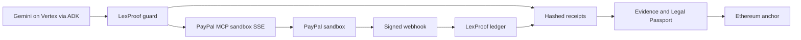

# Devpost draft — LexProof × PayPal

Sandbox only. Submit by 28 October 2026. Judging 1–15 December. Do not put sandbox passwords in this file. Those belong in Devpost's private testing instructions.

Judge URL (no Vercel login): https://lexproof-git-feat-paypal-agentic-payments-pgskannans-projects.vercel.app

Staging API: `lexproof-api-paypal`. Do not deploy this branch to `lexproof-api`.

## Inspiration

Agent toolkits let a language model move money. PayPal's agent toolkit will create an invoice, send it, and refund it, and it does not ask a second human before the merchant-side call. A clause can tell the model to invoice a $50,000 bonus that the parties never approved. We built LexProof so the contract, not the model, decides what money is allowed to move, and so the result can be checked by someone who does not trust our servers.

## What it does

From a signed MSA, LexProof extracts payment obligations and keeps the clause quote verbatim. A reviewer edits the payer email. A different person approves. The approved rows become a mandate hash.

A merchant can then tell the agent "Invoice milestone 1". Gemini, running as an ADK agent on Vertex, proposes PayPal tool calls. A server-side guard checks each call against the exact PayPal tool schema and against the mandate. Create and send are allowed only when the amount, currency, and recipient match an approved obligation. The ledger marks the invoice sent only after PayPal confirms it. The sandbox buyer pays. A signed webhook moves the obligation to PAID. A refund comes back as "Needs approval". A second person executes it once. A second execute is refused. The $50,000 bonus, which was injected into the contract as an instruction to the agent, is blocked.

Every step is a hashed receipt. The public verify page shows the chain. The browser recomputes one receipt hash itself.

## How we built it

- PayPal MCP over SSE on the sandbox, and PayPal's agent toolkit tools (`create_invoice`, `send_invoice`, `get_invoice`, `create_refund`).
- Google ADK on Vertex AI (Gemini), not a Gemini API key.
- A pure guard function with no I/O. It reads the schema we dumped from the live sandbox (`docs/paypal-mcp-schemas.md`).
- Firestore for obligations, the invoice ledger, receipts, payment actions, and webhook events.
- Cloud Run service `lexproof-api-paypal` for the API. Vercel for the branch preview.
- SoD through the existing workflow engine: the requester cannot approve their own refund.
- Signed PayPal webhooks (`INVOICING.INVOICE.PAID`, refunds, and the related capture events) as the source of PAID and REFUNDED.

## Challenges we ran into

The first live run looked successful and was not. The guard allowed a create-invoice call that used fields PayPal's MCP tool does not accept (`recipient_email`, `total`, `amount`). The model thought the invoice was sent. PayPal still had a draft, and a later send failed with `MISSING_RECIPIENT_EMAIL`. Nested errors inside the MCP payload were also stored as success, because we only looked at the top of the tool result.

The fix was to check the exact schema, and to record only what PayPal confirms. After an allowed send, the server calls `get_invoice` itself. The row becomes SENT only when PayPal says SENT or UNPAID, and we store the payer link PayPal returns. If PayPal returns an error name, an issue code, or an HTTP status of 400 or more, the receipt stays `paypal_error` and the chip is amber. That is the rule we want judges to see: the model does not get to declare that money moved.

## Accomplishments that we're proud of

A full sandbox path on staging: seeded MSA, three approved milestones, "Invoice milestone 1" allowed through create and send, the $50,000 bonus blocked, the buyer paid $12,000, the webhook set PAID, the refund waited for a second person, and that person executed it to REFUNDED. A second execute was refused.

The public page "Payments, with proof" shows that chain, and one receipt hash verifies in the browser.

## What we learned

An agent toolkit is not a control. The schema of the tool is part of the control, because a field the model invents is a field PayPal will drop. And a tool result that says "ok" in one layer can still be an error in the next. Confirmation has to be a read from PayPal, not a sentence from the model.

Separation of duties still matters when the requester is an agent. The person who asked for the refund cannot be the person who releases it.

## What's next

Live PayPal, after the sandbox schema and the webhook set have been stable. Multi-currency invoices. A scheduled reset of the judge sandbox contract so every judging day starts clean (the on-demand reset already exists). Passkey-signed approvals inside the anchored bundle.

## Built with

PayPal MCP, PayPal Agent Toolkit, PayPal Invoicing and Webhooks (sandbox), Google ADK, Vertex AI Gemini, Firebase Auth, Firestore, Cloud Run, Next.js, Vercel, Ethereum Sepolia.

## How this maps to the criteria

| Criterion | Where it shows up |
|---|---|
| Technical implementation | Schema-exact guard, PayPal-confirmed ledger, signed webhooks, hashed receipts, SoD workflow, rate limit |
| Design | Payments tab: clause links, status chips, blocked and needs-approval chips, approval history with names, public verify |
| Impact | A merchant can let an agent invoice from a contract without giving the agent an ungoverned refund button |
| Innovation | The mandate is the contract text itself. The guard checks PayPal's tool schema, not a private list of amounts. The model cannot mark an invoice sent |
| Presentation | Five-minute judge path in the README, and the video script in `docs/video-script-paypal.md` |

## Category prizes

**PayPal + AI.** The agent uses PayPal's MCP tools. LexProof adds the human gate PayPal's toolkit does not ship: verbatim clause check, schema guard, and a second person for money out.

**Agentic commerce.** The agent can complete a real sandbox invoice and a real refund, and both are bound to an approved commercial obligation. The $50,000 instruction hidden in the contract does not become a charge.
